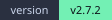
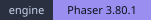

<div align="center">
  

  # Abyss Corridor

  [中文](README.md) ｜ **English**

  **Pure front-end · zero build · no art assets —— a side-scrolling action Roguelike that runs straight in the browser**

  
  
  
  
  

  <sub>9 heroes · 10 enemy types · 24 relics · 15 environment effects · 13 endings</sub>

  <br /><br />

  <a href="https://effervescent-puppy-941d9f.netlify.app/"><b>▶ Play it now (online)</b></a>
</div>

---

## 📖 What is this

**Abyss Corridor** (深渊回廊) is a side-scrolling action Roguelike written by hand in **vanilla HTML / CSS / JavaScript + Phaser 3**.

You pick one of 9 heroes, take a starting boon, and descend into the corridor: room after room, cutting down monsters,
picking up relics and carrying curses. Every floor ends with a floor lord — and the corridor has no bottom. How deep you go is up to you.

There is no bundler, no `npm install` and no CDN. It does not even ship a single art asset:

- **Every character is drawn by code** — 9 heroes × 15 frames, 10 enemy types × 7 frames and 4 projectile skins, all rasterised frame by frame on offscreen canvases;
- **Every sound is synthesised by code** — BGM and SFX are generated live with WebAudio; there is no `.mp3` / `.wav` anywhere in the repo;
- **The engine is vendored** — `vendor/phaser.min.js`, so the game also runs offline.

The whole game is a pile of static files you can open by double-clicking.

---

## ✨ Highlights

| | |
|---|---|
| 🕹️ **Side-scrolling real-time combat** | Charged jumps, dive attacks, dodge rolls, perfect blocks, shield counters, chain attacks and fury bursts — every timing window is learnable |
| 🎭 **9 heroes, each with its own look and feel** | Two systems, melee and ranged; the Ranger, Mage and Sage fire their own projectiles (Gale Arrow / Arcane Orb / Psionic Wave) |
| 👹 **10 enemy types with distinct AI** | Chaser / charger / flyer / ranged kiter / boss. The Mimic **copies your hero's body, gear and attack style** |
| 🧬 **Run-based Roguelike** | 24 relics + 10 curses + 15 environment effects, stacking risk and reward |
| 🗺️ **Branching room map** | Pick your route every floor: enemy / elite / mirror / treasure / shrine / shop / rest / random event / floor lord |
| ♻️ **Two complete builds side by side** | One click in the sidebar switches between 2.7 (real-time 2D) and 2.6 (the frozen legacy build); their saves are kept apart |
| 📱 **Playable on phones** | Virtual stick + touch buttons, automatic landscape and fullscreen, multi-touch, installable as a PWA |
| 💾 **5 save slots** | Import / export / rename / overwrite, autosave, and cross-version migration that only copies — never deletes |
| 📚 **In-game codex** | 10 categories built from the very data the game runs on — the codex cannot lie about the numbers |

---

## 🎮 How to play

### The loop

```
Start screen → pick a hero (9) → pick a starting boon → real-time 2D combat
   ↓
Floor N: entrance → branching rooms (choose your route) → … → floor lord room
   ↓                                                        ↓
clear rooms / grab relics / shop / endure curses ────  beat the floor lord → Abyss Rift choice → next floor
                                                           ↓
                                              "clear conditions" are checked once per floor — meet them and you may pick an ending
```

- There is no floor cap (custom difficulty can set one); dying ends the run;
- After every floor the sidebar's **clear conditions** are evaluated: **meet them and you can finish with an ending, or keep fighting.**

### Room types

| Room | Contents |
|---|---|
| Entrance | Start of the floor, a few enemies |
| Enemy | Regular enemies, more of them as you descend |
| Elite | Elite Guard / Necromancer plus adds, better rewards |
| Mirror | A Mimic that **copies your stats, body and attack style** |
| Treasure | No combat; gold + potions |
| Shrine | Pray for healing, or **sacrifice health to remove one curse** |
| Shop | In-canvas shop: items, purification, relic-related goods |
| Rest | Heal up / tidy your build |
| Random event | One draw from the classic event pool (18+) |
| Floor lord | The floor boss (Floor Lord / Shadow King); beating it takes you deeper |

### Controls

**Keyboard / mouse**

| Key | Action |
|---|---|
| `A` `D` / `←` `→` | Move left / right |
| **Hold** `W` / `Space` / `↑`, **release** to jump | Charged jump (how long you hold decides how high you go) |
| `J` / left mouse button | Attack (ranged heroes fire their own projectile) |
| `J` while airborne | Melee: **dive attack** (shockwave on landing) / Ranged: **air shot** (auto-locks the nearest enemy) |
| **Hold** `S` / `↓` | Guard (shield up, reduced damage from the front; block on the rising edge = **perfect block**) |
| `K` | Dodge (roll costs stamina, grants invincibility frames; dodge on the hit frame = **perfect dodge**) |
| `R` | Fury (burst once the gauge is full: 6 seconds of buffs, but you take more damage) |
| `E` | Hero skill (active skill, once per floor) |
| `L` | Drink a healing potion |
| Walk into the right-side portal | Open the room map and click a glowing neighbour to go deeper |

**Touch**

Left virtual stick (push up = charged jump), a big charged-jump button bottom right, attack bottom centre,
dodge top centre, guard / fury / skill on the right, potion top right.
The on-screen controls show and hide themselves based on your input method — use a mouse and the whole set disappears.

### Combat mechanics at a glance

<details>
<summary>Expand: the core timing windows and what they give you</summary>

| Mechanic | How | Reward |
|---|---|---|
| **Charged jump** | Hold jump to charge in place (the ring under you goes from blue to gold), release to leap | Tap ≈ 80px, full charge ≈ 380px — enough to reach every platform |
| **Dive attack** | Press attack while airborne to slam down fast | ×1.9 on the way down, then a 130px shockwave on landing |
| **Perfect dodge** | Dodge **on the exact frame you would be hit** (within 150ms of the roll) | Full stamina refund + nearby enemies frozen + 3s of "Sharpened" (×2.2 damage, always crits) |
| **Perfect block** | Raise the shield and block a frontal hit within 200ms | No damage at all + attacker knocked back + 3 shield + a 1.2s counter window |
| **Chain attacks** | Sweep / shield counter / lunge slash / landing slash (ranged heroes get four different ones) | Independent windows, with a "press J · XX" prompt above your head |
| **Fury** | Build it by hitting, killing, taking hits, and perfect dodges/blocks | 6 seconds of faster attacks, more damage and more speed — at the cost of +15% damage taken |
| **Stamina** | Dodging and guarding **share one pool** | "Roll or block" is a real decision; the bar glows when a perfect window is coming |
| **Corruption Pulse** | Curses and environments resolve on a beat that speeds up as you descend | Pressure rises over time; the HUD always shows the current beat |
| **Abyss Rift** | A three-way choice after each floor lord | Taste / Sink (take 2 curses for a relic + gold) / Refuse |

</details>

### The 9 heroes

| Hero | Role | Active skill (once per floor) |
|---|---|---|
| Warrior | High health, tanks head-on | War Cry: +6 shield and knocks nearby enemies back |
| Guardian | As tough as it gets | Bulwark: +6 shield, half damage taken for 4s |
| Paladin | Offence and defence | Divine Judgment: +8 shield and heals |
| Rogue | Burst damage | Shadow Dance: ×2 attack for 3s |
| Ranger | Ranged DPS | Precise Shot: fires a piercing arrow |
| Mage | Ranged AoE | Elemental Storm: 210px burst centred on you |
| Sage | Ranged support | Mana Infusion: heal + shield + attack buff |
| Berserker | Stronger as he bleeds | Last Stand: lose 15% current health for 8s of ×2.5 attack and lifesteal |
| Shadow | High risk, high reward | Shadow Strike: 1.2s invincibility + ×3 attack for 3s |

Every hero also has a **passive** (shield at the start of a fight, bonus damage on the first hit, heal on the first kill,
shield on a successful dodge …) plus a full set of bespoke animations and weapon silhouettes —
see [`其他/角色形象设定.md`](其他/角色形象设定.md) (Chinese).

---

## 🚀 Quick start

### Option 1: play online

Already deployed on Netlify — click and play, no download, no sign-up:

```
https://effervescent-puppy-941d9f.netlify.app/
```

### Option 2: a local server (recommended)

The game uses a PWA manifest, the fullscreen API, orientation lock and `fetch`, all of which browsers restrict under `file://`,
so **opening it through a local server is recommended**:

```bash
# A: the debug server that ships with the project (port 8123, caching disabled)
python 其他/本地服务器.py
# then open http://127.0.0.1:8123/

# B: any static server
python -m http.server 8123
npx serve .
```

> 💡 `其他/本地服务器.py` adds `Cache-Control: no-store` to every response.
> That matters a lot when debugging on a phone: a plain `http.server` sends no cache headers, browsers then
> heuristically cache the **HTML**, and you end up chasing "I changed the code but my phone still shows the old build".

### Option 3: just double-click it

`index.html` in the repo root redirects to `主界面.html`, so double-clicking is enough for a quick look
(PWA and automatic landscape will not work that way).

### Playing on a phone

1. Open one of the addresses above in your phone browser (same LAN as your PC — use the PC's local IP);
2. **iPhone / iPad**: Safari has no element-fullscreen API, so automatic landscape is impossible — for a real fullscreen experience tap "Share → Add to Home Screen" and launch from the home screen icon;
3. **Android**: entering 2D combat requests fullscreen + landscape lock automatically; if a system dialog knocks it out, one tap on the screen restores it.

### Deploying it yourself

The whole game is static files, so any static host will do (the author currently uses Netlify):
point the host at the repo, leave the build command empty and set the publish directory to the repo root.

GitHub Pages works just as well: `Settings → Pages → Source: Deploy from a branch`, pick the `main` branch and `/ (root)`;
once enabled the address is `https://sjgfusv.github.io/shenyuanhuilang/`.

Neither option needs any extra configuration — `index.html` in the root already handles the redirect.

---

## 🗂️ Project structure

```
深渊回廊/
├── README.md                # Chinese README (the main one)
├── README.en.md             # This file — the two link to each other at the top
├── index.html              # Entry point: redirects to 主界面.html
├── 主界面.html              # The single page shell (start screen / sidebar / every modal / the 2D stage container)
├── 主样式.css               # All styles
├── 主程序.js                # Core: heroes / rooms / economy / difficulty / endings / codex / saves / cheats / dev commands
├── 经典2D.js                # Host: turns the core's room list into 2D rooms and writes real-time results back
├── 战斗2D.js                # Presentation: the real-time action engine (physics / enemy AI / HUD / in-canvas panels)
├── 角色形象.js              # Procedural sprite generation for 9 heroes + 10 enemy types
├── AbyssAudio.js            # Procedural audio engine (BGM + SFX, all synthesised live)
├── 试炼程序.js               # Legacy: the 2.6 trial-mode layer (shut down in the new build, no longer loaded)
├── manifest.webmanifest     # PWA manifest
├── jsconfig.json            # Editor type hints (not used at runtime)
├── favicon.ico / logo.png   # Icons
├── LICENSE                  # MIT license
├── badges/                  # Local badge SVGs for both READMEs (Chinese at the root, English under badges/en/)
├── logo/                    # Logo variants and the scripts that generate them
├── vendor/
│   └── phaser.min.js        # Phaser 3.80.1 (vendored, no network needed)
├── 老版2.6/                  # The frozen 2.6 build (classic turn-based + 2D trials, switchable from the sidebar)
├── 测试/                     # Browser test panel and regression scripts
├── 其他/                     # Debug server, design docs, preview pages, historical changelog
└── 待做/                     # Plans and open issues
```

> All file names are in Chinese because the game itself is Chinese; the source is UTF-8 throughout.

### Layering

```
Core        主程序.js    Game rules: floors / economy / difficulty / endings / saves / codex (not a line of 2D code)
  ↑ narrow interface window.经典2D内核
Host        经典2D.js    Room mapping / stat mapping / event write-back / panel contents
  ↑ bridge API + events
Presentation 战斗2D.js  Pure real-time combat front end (rendering / physics / AI / HUD, no game rules)
Assets      角色形象.js / AbyssAudio.js / 主样式.css
```

Engine and host talk through a **pluggable contract**: `startRun` goes in, events and `bridge` come out,
which is why the same combat engine still serves the legacy 2.6 build as well.

---

## 🏗️ Tech stack and implementation

- **Stack**: vanilla HTML / CSS / JavaScript (ES2024, no framework, no TypeScript, no bundler) + Phaser 3.80.1
- **Dependencies**: none — no `npm`, no `node_modules`; clone it and it runs
- **Size**: roughly 33,000 lines of hand-written code (`主程序.js` 12k / `战斗2D.js` 10k / `经典2D.js` 2.4k / `主样式.css` 5.6k …)
- **Saves**: `localStorage`, 5 slots + import/export; 2.7 uses its own namespace so the two builds never collide
- **Assets**: **zero external files**. Sprites are drawn frame by frame on offscreen canvases and cached by key; audio is synthesised live with WebAudio

### Details worth a look

<details>
<summary><b>Character art: one part library, 19 characters</b></summary>

Five part families (`head / weapon / offhand / legs / extras`) plus body parameters share one codebase yet look nothing alike:
silhouette first (at 64px tall and moving fast, the outline is the only thing you can read instantly), colour as identity
(purple=arcane / green=ranger / gold=elite / blood red=floor lord …).
Health bar widths are derived from the **measured ink extents** of every frame, so an enemy bar never looks wider than its owner.

</details>

<details>
<summary><b>Audio: BGM and SFX with no audio files</b></summary>

`AbyssAudio.js` synthesises everything from oscillators, noise and filters, with scenes for menu / explore / battle / elite /
mirror / boss / shop / rest / choice / ending. If the audio engine is missing, locked or muted by the user, every call is
silently skipped — audio can never break combat.

</details>

<details>
<summary><b>Fallback chain: it never just goes blank</b></summary>

`WebGL → Canvas → explanatory panel`. If the WebGL probe fails it retries with Canvas at low quality; if both renderers fail
a panel explains why and offers three ways out: retry 2D, switch to the legacy 2.6 build, or continue in text mode.

</details>

<details>
<summary><b>Frame-level performance: object pools and texture caching</b></summary>

Pooled floating text, rotating particle emitters, batched floors and platforms via TileSprite, health bar textures cached
1:1 by size, starfield updates throttled to every third frame, map nodes destroyed together with their tweens on close.
A stress scene with 7 enemies attacking continuously costs about 1.16ms per frame, and the number of display objects
and textures stays flat over long fights.

</details>

<details>
<summary><b>Mobile: landscape, fullscreen and visualViewport</b></summary>

`orientation.lock('landscape')` must be called inside a user gesture, so the fullscreen request hangs off the "Start game"
button; if a system dialog knocks it out, touch events re-lock it. The container height is written into a CSS variable from
`visualViewport.height` so bottom buttons are not pushed under the address bar. iOS Safari has no element fullscreen —
there the official route is "Add to Home Screen".

</details>

---

## 📚 Development docs

`其他/` and `待做/` keep the full development trail. If you want to dig into the implementation, read them in this order
(the documents are in Chinese):

| Document | Contents |
|---|---|
| [`其他/2D实时战斗实现说明.md`](其他/2D实时战斗实现说明.md) | Combat design, architecture, public API, AI state machine, design system and per-item measurements |
| [`其他/角色形象设定.md`](其他/角色形象设定.md) | Silhouette design and procedural drawing conventions for all 19 characters |
| [`待做/2.7规划.md`](待做/2.7规划.md) | The complete 2.7 plan ("merge trials into classic") with per-phase delivery records |
| [`待做/2.7合并遗留修复清单.md`](待做/2.7合并遗留修复清单.md) | Post-merge issues and the evidence gathered while fixing them |
| `其他/*预览.html` | Standalone preview pages (start screen / character art / trial styles) running the same code as the game |
| `测试/*.js` | Regression scripts for items, relics, environments, monsters, saves, mobile layout and more |

---

## 🗺️ Versions and roadmap

- **v2.7.2** (current) feel and display fixes — see the in-game changelog
- **v2.7** two builds and a fully 2D game: classic mode became real-time 2D, trials were merged in and shut down, 2.6 was frozen
- **v2.6** 2D trials: turn-based combat rebuilt as a side-scrolling action game
- **v0.1 → v2.5** from a text roguelike upwards: hero skills, relics, endings, codex, saves, cheat panel, custom difficulty, random events…

Next steps and known trade-offs live in [`待做/`](待做) — load-time performance, more monsters and events, and so on.

---

## ❓ FAQ

<details>
<summary><b>Why does opening the file directly behave oddly on a phone?</b></summary>

Under `file://` the PWA, fullscreen, orientation lock and some network requests are all restricted by the browser.
Use one of the local-server options from "Quick start" instead.

</details>

<details>
<summary><b>Why does the game not switch to landscape on iPhone?</b></summary>

iOS Safari does not provide an element-fullscreen API, and `screen.orientation.lock()` requires fullscreen first —
so that route is closed on iPhone / iPad from the start. The only official way to get a real fullscreen is
"Share → Add to Home Screen"; launched that way it runs in its own window with no address bar.

</details>

<details>
<summary><b>Where are my saves? Can I lose them?</b></summary>

In your browser's `localStorage` (2.7 uses `abyss27_*` keys, the legacy build keeps `abyss_*`, so they never interfere).
Clearing browser data clears the saves with it — export anything you care about via "Save management → Export".

</details>

<details>
<summary><b>What is the legacy "2.6" build?</b></summary>

2.6 is the previous complete release (turn-based classic plus 2D trials), kept as a frozen snapshot in `老版2.6/`
and reachable from the sidebar at any time. The two builds keep separate progress.

</details>

<details>
<summary><b>The game is hard — is there any way to cheat?</b></summary>

Yes. A cheat panel is built into the game (open it from the sidebar) and there is a developer mode
(add `?dev=true` to the URL for console commands to skip floors, grant relics, add curses and so on).
`测试/测试面板.html` and the regression scripts exist for verifying values and flows.

</details>

---

## 👤 Author

**heshen** — all 30,000+ lines written by one person.

From the v0.1 text roguelike to the 2.7 side-scrolling action game, through turn-based combat, 2D trials,
two coexisting builds and their eventual merge. The changelog and every round of feedback in `待做/` are still in the repo.

> That "— 咕咕嘎嘎 —" on the start screen is an easter egg. Do not ask.

## 📄 License

Released under the [MIT License](LICENSE) — use it, modify it and redistribute it freely, just keep the copyright notice.

Character sprites, sound and logo are all generated by the code in this repository; no third-party assets are involved,
so go ahead and change whatever you like.

## ⭐ About

If this project looks like fun, a star is appreciated — or open an issue and tell me how deep into the corridor you got.
