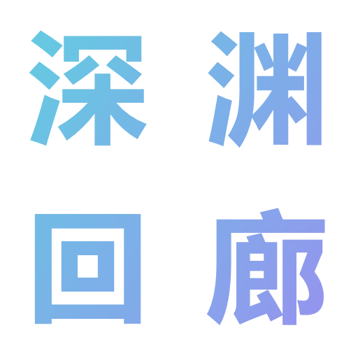
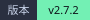
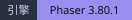
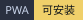
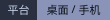

<div align="center">
  

  # 深渊回廊

  **中文** ｜ [English](README.en.md)

  **纯前端 · 零构建 · 无外部素材 —— 打开浏览器就能玩的横版实时动作 Roguelike**

  
  
  
  
  

  <sub>9 位英雄 · 10 种敌人 · 24 件遗物 · 15 条环境效果 · 13 种结局</sub>

  <br /><br />

  <a href="https://effervescent-puppy-941d9f.netlify.app/"><b>▶ 点这里直接开玩（在线版）</b></a>
</div>

---

## 📖 这是什么

《深渊回廊》是一款用 **原生 HTML / CSS / JavaScript + Phaser 3** 手写的横版实时动作 Roguelike。

你从 9 位英雄中挑一位，带着一项开局增益深入深渊回廊：一层接一层地闯房间、砍怪、拾遗物、扛诅咒，
每层的尽头是层主，而回廊本身没有底 —— 你想走多深，就走多深。

它没有打包器、没有 `npm install`、没有依赖 CDN，甚至连一张美术素材都没有：

- **所有角色都是代码画出来的** —— 9 位英雄 × 15 帧、10 种怪物 × 7 帧、4 种弹道外观，全部由离屏 Canvas 逐帧程序化绘制；
- **所有音乐音效都是代码合成的** —— 基于 WebAudio 实时合成，没有 `.mp3` / `.wav` 文件；
- **引擎是本地引入的** —— `vendor/phaser.min.js`，离线也能跑。

整个游戏就是一堆可以直接双击运行的文件。

<!-- 想补充游戏截图的话，把图片放进仓库后在下面这行加：  -->

---

## ✨ 亮点

| | |
|---|---|
| 🕹️ **横版实时动作** | 蓄力跳、跳劈、翻滚闪避、举盾完美格挡、盾反、连招、狂怒爆发 —— 判定窗口全部可背 |
| 🎭 **9 位英雄各有形象与手感** | 近战 / 远程两套体系；游侠、法师、贤者的普攻是各自的专属弹道（疾风箭 / 奥术弹 / 灵能波） |
| 👹 **10 种敌人各有一套 AI** | 追击 / 冲锋 / 飞行 / 远程风筝 / 首领；镜像怪会**照抄你当前英雄的体型、装备与攻击方式** |
| 🧬 **局内 Roguelike** | 24 件遗物 + 10 条诅咒 + 15 条环境效果，三层收益／风险叠在一起 |
| 🗺️ **分支房间地图** | 每层自选路线：敌袭 / 精英 / 镜像 / 宝箱 / 祭坛 / 商店 / 休整点 / 随机事件 / 层主 |
| ♻️ **两套完整版本共存** | 侧边栏一键在 2.7（2D 实时）与 2.6（冻结的老版）之间切换，两边存档互相隔离 |
| 📱 **手机可玩** | 虚拟摇杆 + 触控按钮、自动横屏与全屏、多点触控、PWA 加到主屏幕后无地址栏 |
| 💾 **5 个存档位** | 支持导入 / 导出 / 改名 / 覆盖，自动存档，跨版本迁移只复制不删除 |
| 📚 **游戏内图鉴** | 10 个分类、与运行时代码同源的数据 —— 改数值不会让图鉴说谎 |

---

## 🎮 怎么玩

### 一局的流程

```
开始界面 → 选英雄（9 选 1）→ 选开局增益 → 2D 实时战斗
   ↓
第 N 层：入口 → 分支房间（自选路线）→ … → 层主房
   ↓                                                        ↓
清房 / 拾遗物 / 逛商店 / 扛诅咒 ────────────────────  击败层主 → 深渊裂隙抉择 → 下一层
                                                           ↓
                                              每层结算一次「通关条件」，达成即可选择结局
```

- 楼层没有上限（自定义难度可设层数上限），死亡即结束本局；
- 每打完一层，会按侧边栏「通关条件」结算一次：**达成即可选择结局通关，也可以继续战斗**。

### 房间类型

| 房间 | 内容 |
|---|---|
| 入口 | 本层起点，少量敌人 |
| 敌袭 | 普通敌人，数量随层数增加 |
| 精英战 | 精英守卫 / 死灵法师 + 杂兵，收益更高 |
| 镜像 | 镜像怪，**属性、体型与攻击方式复制你** |
| 宝箱 | 无战斗，金币 + 药水 |
| 祭坛 | 祈祷回血，或**献祭生命解除一条诅咒** |
| 商店 | 画内商店：道具、净化、遗物相关 |
| 休整点 | 回复生命 / 整理状态 |
| 随机事件 | 从经典事件池中抽一条（18+ 条） |
| 层主 | 每层 Boss（层主 / 影之皇），击败后进入下一层 |

### 操作

**键盘 / 鼠标**

| 按键 | 动作 |
|---|---|
| `A` `D` / `←` `→` | 左右移动 |
| **按住** `W` / `空格` / `↑`，**松开**起跳 | 蓄力跳（按多久决定跳多高） |
| `J` / 鼠标左键 | 攻击（远程英雄为专属远程攻击） |
| 滞空时 `J` | 近战：**跳劈**（落地冲击波）／远程：**空中射击**（自动锁最近敌人） |
| **按住** `S` / `↓` | 防御（举盾，正面减伤；抬盾瞬间挡下 = **完美格挡**） |
| `K` | 闪避（翻滚冲刺，消耗体力换无敌帧；命中瞬间闪 = **完美闪避**） |
| `R` | 狂怒（怒槽满后爆发，6 秒强化但受伤增加） |
| `E` | 英雄技能（主动技能每层一次） |
| `L` | 喝治疗药水 |
| 走进右侧传送门 | 打开房间地图，点选发光的相邻房间继续深入 |

**触摸**

左下虚拟摇杆（向上推 = 蓄力跳）、右下蓄力跳按钮、中下攻击、上中闪避、右侧防御 / 狂怒 / 技能、右上药水；
控件按输入方式自动显隐 —— 用鼠标时整组隐藏，画面保持干净。

### 战斗机制速览

<details>
<summary>展开：核心判定窗口与收益</summary>

| 机制 | 做法 | 收益 |
|---|---|---|
| **蓄力跳** | 按住跳跃键原地蓄力（脚底光圈由蓝转金），松开才起跳 | 轻点 ≈ 80px，满蓄力 ≈ 380px，够到全部平台 |
| **跳劈** | 滞空时按攻击键高速下坠 | 下坠命中 ×1.9，落地炸开半径 130px 冲击波 |
| **完美闪避** | 在**被打中的那一瞬间**闪避（起手 150ms 内挡下） | 体力全返 + 定身周围敌人 + 3 秒「锐利」（伤害 ×2.2 且必定暴击） |
| **完美格挡** | 抬盾成型后 200ms 内挡下正面攻击 | 完全免伤 + 震开攻击者 + 护盾 +3 + 打开 1.2 秒盾反窗口 |
| **连招** | 横扫 / 盾反 / 突进斩 / 落地斩（远程英雄是另外四招） | 各自独立窗口，头顶提示「接 J · XX」 |
| **狂怒** | 命中、击杀、受击、完美闪避/格挡都攒怒 | 6 秒内攻速 / 伤害 / 移速全面提升，代价是受伤 +15% |
| **体力** | 闪避与举盾**共用**同一个体力池 | 「闪 or 挡」是真抉择，危险窗口体力条会亮起呼吸光 |
| **腐化脉冲** | 诅咒与环境按节拍结算（间隔随层数变快） | 压力随时间上升，HUD 常驻显示当前节拍 |
| **深渊裂隙** | 每层打完层主后的三选一抉择 | 浅尝 / 沉沦（接 2 条诅咒换遗物 + 金币）/ 拒绝 |

</details>

### 9 位英雄

| 英雄 | 定位 | 主动技能（每层一次） |
|---|---|---|
| 战士 | 高生命正面抗伤 | 战吼：+6 护盾并震退周围敌人 |
| 守护者 | 硬到极致 | 护盾壁垒：+6 护盾，4 秒内受伤减半 |
| 圣骑士 | 攻守兼备 | 神圣审判：+8 护盾并回血 |
| 刺客 | 高爆发 | 影舞突袭：3 秒内攻击 ×2 |
| 游侠 | 远程射手 | 精准射击：射出穿透箭 |
| 法师 | 远程范围 | 元素风暴：以自身为中心 210px 爆发 |
| 贤者 | 远程辅助 | 法力灌注：回血 + 护盾 + 攻击强化 |
| 狂战士 | 越残越猛 | 破釜沉舟：掉 15% 当前生命换 8 秒攻击 ×2.5 与吸血 |
| 暗影 | 高风险高回报 | 暗影突袭：1.2 秒无敌 + 3 秒攻击 ×3 |

每位英雄都有一套**被动**（战斗开始给盾、首击加伤、首次击杀回血、闪避成功给盾……），
以及一整套专属动画与武器轮廓 —— 详见 [`其他/角色形象设定.md`](其他/角色形象设定.md)。

---

## 🚀 快速开始

### 方式一：在线试玩

已部署在 Netlify，点开即玩（不用下载、不用注册）：

```
https://effervescent-puppy-941d9f.netlify.app/
```

### 方式二：本地服务器（推荐）

游戏用到了 PWA 清单、全屏 API、横屏锁定与 `fetch`，这些在 `file://` 下会被浏览器限制，
所以**推荐用本地服务器打开**：

```bash
# 方式 A：项目自带的调试服务器（默认端口 8123，已禁用缓存）
python 其他/本地服务器.py
# 打开 http://127.0.0.1:8123/

# 方式 B：任意静态服务器
python -m http.server 8123
npx serve .
```

> 💡 项目自带的 `其他/本地服务器.py` 会给所有响应加上 `Cache-Control: no-store`。
> 手机调试时这一步很关键 —— 普通 `http.server` 不发缓存头，浏览器会按启发式缓存把
> **HTML** 缓存住，出现「改了代码手机还是旧的」这种极难排查的现象。

### 方式三：直接双击打开

根目录的 `index.html` 会自动跳转到 `主界面.html`，双击即可快速试玩（PWA / 自动横屏不可用）。

### 在手机上玩

1. 用手机浏览器打开上面任一地址（需与电脑同一局域网，用电脑的局域网 IP）；
2. **iPhone / iPad**：Safari 不支持元素全屏 API，无法自动横屏 —— 想全屏请点「分享 → 添加到主屏幕」，从主屏幕图标启动；
3. **Android**：进入 2D 战斗会自动请求全屏 + 锁横屏；被系统弹窗顶掉后碰一下屏幕即可自愈。

### 部署到静态托管

整个游戏就是一堆静态文件，任何静态托管都能直接放（作者目前用的是 Netlify）：
把仓库连上平台，构建命令留空、发布目录填根目录即可，不需要任何配置。

想用 GitHub Pages 也一样：`Settings → Pages → Source: Deploy from a branch`，
选 `main` 分支的 `/ (root)`，开启后地址就是 `https://sjgfusv.github.io/shenyuanhuilang/`。

两种方式都不用额外设置 —— 根目录的 `index.html` 已经做了跳转。

---

## 🗂️ 目录结构

```
深渊回廊/
├── README.md                # 中文说明（本文件）
├── README.en.md             # English README（顶部可互相切换）
├── index.html              # 入口：自动跳转到 主界面.html
├── 主界面.html              # 单页外壳（开始界面 / 侧边栏 / 所有模态框 / 2D 舞台容器）
├── 主样式.css               # 全部样式
├── 主程序.js                # 内核：英雄 / 房间 / 经济 / 难度 / 结局 / 图鉴 / 存档 / 作弊 / 开发者命令
├── 经典2D.js                # 宿主：把内核的房间序列翻译成 2D 房间，并把实时结果回写内核
├── 战斗2D.js                # 表现层：实时动作引擎（物理 / 敌人 AI / HUD / 画内面板）
├── 角色形象.js              # 9 位英雄 + 10 种怪物的程序化精灵生成
├── AbyssAudio.js            # 程序化音频引擎（BGM + 音效全部实时合成）
├── 试炼程序.js               # 遗留：2.6 试炼模式的业务层（新版已关停，不再加载）
├── manifest.webmanifest     # PWA 清单
├── jsconfig.json            # 编辑器的 JS 类型提示配置（不参与运行）
├── favicon.ico / logo.png   # 图标
├── LICENSE                  # MIT 许可证
├── badges/                  # 两个 README 顶部的徽章 SVG（中文版在根下，英文版在 badges/en/）
├── logo/                    # logo 的多个版本与生成脚本
├── vendor/
│   └── phaser.min.js        # Phaser 3.80.1（本地引入，无网络依赖）
├── 老版2.6/                  # 冻结的 2.6 完整版本（经典回合制 + 2D 试炼，侧边栏可切换）
├── 测试/                     # 浏览器测试面板与回归脚本
├── 其他/                     # 调试服务器、设计文档、预览页、历史更新日志
└── 待做/                     # 规划与遗留清单
```

### 分层架构

```
内核层   主程序.js    玩法规则：楼层 / 经济 / 难度 / 结局 / 存档 / 图鉴（不含任何 2D 代码）
  ↑ 窄接口 window.经典2D内核
宿主层   经典2D.js    房间映射 / 属性映射 / 事件回写 / 面板内容
  ↑ 桥接 API + 事件
表现层   战斗2D.js    纯实时战斗前端（渲染 / 物理 / AI / HUD，不含玩法规则）
资源层   角色形象.js / AbyssAudio.js / 主样式.css
```

引擎与宿主之间是**可插拔契约**：`startRun` 进、事件与 `bridge` 出，
所以同一套战斗引擎既服务于新版，也能被老版（2.6 的 `试炼程序.js`）继续调用。

---

## 🏗️ 技术栈与实现

- **技术栈**：原生 HTML / CSS / JavaScript（ES2024，无框架、无 TypeScript、无打包器）+ Phaser 3.80.1
- **依赖安装**：无。`npm` / `node_modules` 都不需要，克隆下来就能跑
- **代码量**：约 3.3 万行手写代码（`主程序.js` 1.2 万 / `战斗2D.js` 1.0 万 / `经典2D.js` 0.24 万 / `主样式.css` 0.56 万 …）
- **存档**：`localStorage`，5 槽位 + 导入导出；2.7 使用独立命名空间，与老版互不干扰
- **资源**：**零外部素材**。角色精灵由离屏 Canvas 逐帧绘制并按 key 缓存；音频由 WebAudio 实时合成

### 一些值得一看的实现细节

<details>
<summary><b>角色形象：一套部件库拼出 19 个角色</b></summary>

`head / weapon / offhand / legs / extras` 五个部件族 + 体型参数，共享代码却互不相似：
剪影优先（64px 高、快速移动中唯一能瞬间读懂的是轮廓）、配色即身份（紫=奥术 / 绿=游侠 / 金=精英 / 血红=层主…）。
血条宽度按每个角色所有帧的**实测墨迹范围**定宽，敌人血条不会比人宽一截。

</details>

<details>
<summary><b>音频：没有音频文件的 BGM 与音效</b></summary>

`AbyssAudio.js` 用振荡器 / 噪声 / 滤波器实时合成，支持菜单 / 探索 / 战斗 / 精英 / 镜像 / 首领 / 商店 / 休整 / 抉择 / 结局等场景切换。
音频引擎缺失、未解锁或用户关闭音效时全部静默跳过，绝不影响战斗。

</details>

<details>
<summary><b>降级链：起不来也不会白屏</b></summary>

`WebGL → Canvas → 说明面板`。WebGL 探测失败自动换 Canvas 并降为 low 画质；
两种渲染器都失败时弹出面板说明原因，并提供「重试 2D / 切换到老版 2.6 / 继续文字模式」三个出口。

</details>

<details>
<summary><b>帧级性能：对象池与纹理缓存</b></summary>

飘字对象池、粒子发射器轮转、地板与平台用 TileSprite 合批、血条纹理按尺寸 1:1 缓存、
星空降频、地图关闭时统一销毁并清理补间。实测 7 敌人持续攻击压力场景约 1.16ms/帧，
长时间战斗的显示对象与纹理数量保持恒定。

</details>

<details>
<summary><b>移动端：横屏、全屏与 visualViewport</b></summary>

`orientation.lock('landscape')` 必须在用户手势链内调用，所以全屏请求挂在「开始游戏」按钮上；
被系统弹窗顶掉后靠触摸事件自愈重锁。容器可视高度由 `visualViewport.height` 写入 CSS 变量，
底部按钮才不会被地址栏压住。iOS Safari 不支持元素全屏，走「添加到主屏幕」的官方途径。

</details>

---

## 📚 开发文档

仓库里的 `其他/` 与 `待做/` 保留了完整的开发过程记录，想深入了解实现可以按这个顺序看：

| 文档 | 内容 |
|---|---|
| [`其他/2D实时战斗实现说明.md`](其他/2D实时战斗实现说明.md) | 实时战斗的玩法、架构、对外接口、AI 状态机、设计系统与逐项实测数据 |
| [`其他/角色形象设定.md`](其他/角色形象设定.md) | 19 个角色的剪影设计与程序化绘制约定 |
| [`待做/2.7规划.md`](待做/2.7规划.md) | 2.7「试炼并入经典」的完整规划与各阶段交付记录 |
| [`待做/2.7合并遗留修复清单.md`](待做/2.7合并遗留修复清单.md) | 合并后的遗留问题与逐轮修复证据 |
| `其他/*预览.html` | 开始界面 / 角色形象 / 试炼样式的独立预览页（与游戏内同一份代码） |
| `测试/*.js` | 商品 / 遗物 / 环境 / 怪物 / 存档 / 移动端适配等回归脚本 |

---

## 🗺️ 版本与路线

- **v2.7.2**（当前）手感与显示修复 —— 详见游戏内「更新日志」
- **v2.7** 双版本与 2D 全面化：经典模式全面 2D 实时化，试炼并入并关停，老版 2.6 冻结
- **v2.6** 2D 试炼：回合制战斗改造为横版实时动作
- **v0.1 → v2.5** 从文字肉鸽起步：英雄技能、遗物、结局、图鉴、存档、作弊面板、自定义难度、随机事件…

后续方向与已知取舍记录在 [`待做/`](待做) 中，包括加载性能优化、怪物与事件扩充等。

---

## ❓ 常见问题

<details>
<summary><b>为什么直接用浏览器打开文件、手机上就不对劲？</b></summary>

`file://` 协议下 PWA、全屏、横屏锁定与部分网络请求都会被浏览器限制。
请用「快速开始」里的任一本地服务器方式打开。

</details>

<details>
<summary><b>iPhone 上为什么不自动横屏？</b></summary>

iOS Safari 不提供元素全屏 API，而 `screen.orientation.lock()` 要求先进入全屏 —— 这条路在 iPhone / iPad 上从根上走不通。
唯一能拿到真全屏的官方途径是「分享 → 添加到主屏幕」，从主屏幕图标启动后会以独立窗口运行，没有地址栏。

</details>

<details>
<summary><b>我的存档在哪？会丢吗？</b></summary>

存在浏览器的 `localStorage` 里（2.7 使用 `abyss27_*` 键，老版继续用 `abyss_*`，两边互不影响）。
清空浏览器数据会连同存档一起清掉，重要进度请用「存档管理 → 导出」。

</details>

<details>
<summary><b>「老版 2.6」是什么？</b></summary>

2.6 是回合制 + 2D 试炼的上一代完整版本，作为冻结快照保留在 `老版2.6/` 里，随时可从侧边栏切过去。
两版进度各自独立。

</details>

<details>
<summary><b>游戏很难，有调试手段吗？</b></summary>

有。游戏内自带作弊面板（侧边栏进入）与开发者模式（地址后加 `?dev=true`，控制台可用命令跳层、发遗物、加诅咒等），
另有 `测试/测试面板.html` 与各回归脚本用于验证数值与流程。

</details>

---

## 👤 作者

**heshen** —— 一个人写完的 3 万多行。

从 v0.1 的文字肉鸽一路更到 2.7 的横版实时动作，中间经历过回合制、2D 试炼、
双版本共存与合并，更新日志与 `待做/` 里的每一轮反馈记录都还在仓库里。

> 开始界面那句「— 咕咕嘎嘎 —」是彩蛋，别问。

## 📄 许可

本项目采用 [MIT License](LICENSE) 开源 —— 可以自由使用、修改、分发，保留版权声明即可。

角色精灵、音效与 logo 全部由本仓库的代码生成，不涉及任何第三方素材，所以放心拿去改。

## ⭐ 关于

如果这个项目让你觉得有点意思，欢迎点个 Star，或者在 Issue 里告诉我你在深渊里走到了第几层。
